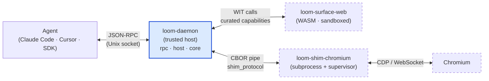
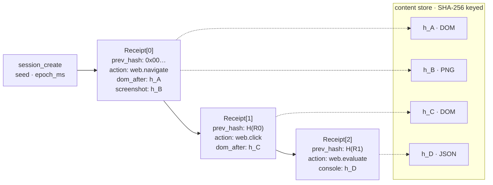

# Loom

[](https://github.com/mentiora-ai/loom/actions/workflows/ci.yml)
[](https://github.com/mentiora-ai/loom/releases/latest)
[](https://www.npmjs.com/package/@mentiora-ai/loom-sdk)
[](#license)
[](https://www.rust-lang.org/)
[](#install)

**Agent-first browser automation runtime.** A local daemon + CLI + MCP
server that drives a real Chromium subprocess through a deterministic
action store. Playwright and CDP were built for humans testing their own
sites; Loom is shaped for the case where the caller is an LLM agent that
needs to browse, fill forms, run JavaScript, and reliably know whether each
action worked — with replay-equal hash chains, content-addressed artifacts,
and a typed error wire shape that doesn't leak generic `internal_error`
strings.

```
┌─────────────┐         ┌──────────────┐         ┌────────────────┐
│ loom (CLI)  │  ────►  │ loom-daemon  │  ────►  │ loom-shim-     │  ────► Chromium
│ loom-mcp    │  ◄────  │  (sessions,  │  ◄────  │  chromium      │
│ Claude/etc  │  JSON   │   replay,    │ CBOR    │  (CDP via WS)  │
└─────────────┘  RPC    │   manifest)  │         └────────────────┘
                        └──────────────┘
```

**Platforms.** macOS arm64/x86_64 and Linux x86_64/arm64. Windows is not supported on v0.9.2.

## If you've hit the vibe-coding testing wall

You shipped the feature in two evenings. You want browser tests so you
can stop manually clicking through every release. You asked the agent to
wire up Playwright. The suite passed — once. Now half the runs flake on
timing, a quarter flake on a popup the agent doesn't know about, and
every "just fix the flake" eats two hours and ends with three more
`waitForTimeout(2000)` calls you're not proud of.

These don't break for *random* reasons — they break because the tooling
underneath was built for a human watching a screen. The agent has no
replay, no typed feedback, no budget. When something goes wrong it goes
wrong silently, and you debug by re-running until you get lucky.

Loom is the runtime you actually want for this:

| You hit                                                | Loom answer                                                                |
|--------------------------------------------------------|----------------------------------------------------------------------------|
| Flake from timing / animations / `Math.random`         | Clocks, RNG, and animations frozen at session-create                       |
| "Passed yesterday, fails today" with no useful diff    | Hash-chain WAL — `loom session diff` finds the one action that diverged    |
| `Error: Timeout 30000ms exceeded` strings              | Typed errors (`kind: "wait_predicate_false"`, …) the agent can branch on   |
| Glue code between Claude Code and Playwright           | Bundled MCP server — actions show up as native tools, no shim              |
| Agent stuck in a loop melting the laptop               | Per-session budgets on wall-clock, network bytes, DOM nodes, JS heap       |
| OAuth tokens passed around as cookie jars              | Scoped grants tied to (session, origin, scopes, ttl); agent never sees the token |

If you're three hours into a flaky test session right now, the
[5-minute quickstart](#5-minute-quickstart) below is a fair deal.

## What makes loom different

- **Deterministic replay.** Every action goes into a manifest WAL with a
  SHA-256 hash chain. `loom session replay <id>` reproduces the action
  chain bit-for-bit (excluding screenshot blobs, by design).
- **Typed errors over the wire.** `kind: "http_status"` with a real status
  code, `kind: "dns_failure"` with the chromium error name, `kind:
  "wait_predicate_false"` when a `web.wait` selector never appears — not
  a generic 500.
- **MCP-native.** `loom-mcp serve` exposes `loom.web.navigate`,
  `loom.web.click`, `loom.web.evaluate`, etc. as MCP tools with implicit
  session management — no `session_id` boilerplate in the client.
- **WASM-isolated surfaces.** The Chromium driver lives in a separate
  process; the WIT-based surface API is loaded as a wasmtime component,
  so a hostile page can't reach the host process directly.
- **Content-addressed everything.** DOM snapshots, screenshots, and
  exported tarballs all live in CAS keyed by SHA-256.
- **Per-session resource budgets.** Hard limits on wall-clock, network
  bytes, DOM nodes, and JS heap. Breaching any of them kills the session
  and returns a typed `budget-exceeded` error, so a runaway agent can't
  open 400 tabs and melt the host. Configurable at session-create:
  `loom session create --budget network=10MB,wall_clock=30s`.
- **Scoped OAuth credential vault.** Grants are tied to (`session_id`,
  `origin`, `scopes`, `ttl`); the agent process never sees the token, the
  vault attaches it origin-scoped at request time, and every use lands in
  the session's audit log. Backed by the OS keychain on macOS.
- **Time-travel inspect.** `loom session inspect <id> --at-action N`
  reconstructs the session state at any point in the action chain — DOM,
  screenshots, network, console — without re-running anything.

## How loom compares

Honest matrix versus the other tools you'd reach for. Loom is not trying to
win on every axis — it's trying to be obviously the right pick when
replay-equality, MCP-native ergonomics, or process isolation actually matter,
and the wrong pick when you need cross-browser coverage, Windows, or the
biggest community.

|                                              | **loom**            | Playwright                | Puppeteer        | Browserbase + Stagehand    | browser-use            | Anthropic Computer Use |
|----------------------------------------------|---------------------|---------------------------|------------------|----------------------------|------------------------|------------------------|
| Bit-equal deterministic replay               | ✓ hash-chain WAL    | trace viewer (descriptive)| —                | —                          | —                      | —                      |
| MCP server, no `session_id` plumbing         | ✓ bundled           | external¹                 | —                | partial²                   | —                      | —                      |
| Typed errors (`kind: …`) for LLM consumers   | ✓                   | string messages           | string messages  | partial                    | string messages        | n/a                    |
| WASM-isolated page driver                    | ✓                   | —                         | —                | —                          | —                      | —                      |
| Local, no per-minute cloud bill              | ✓                   | ✓                         | ✓                | ✗ cloud                    | ✓                      | API per call           |
| Approach                                     | DOM + CDP           | DOM + CDP                 | DOM + CDP        | DOM + CDP (cloud)          | DOM + vision           | pure vision            |
| Browsers                                     | Chromium            | Chromium / Firefox / WebKit | Chromium       | Chromium                   | Chromium / Firefox / WebKit | any (vision)      |
| Windows                                      | ✗                   | ✓                         | ✓                | ✓                          | ✓                      | ✓                      |
| SDKs                                         | Rust + Python + TS  | very wide                 | Node             | Node + Python              | Python                 | any (HTTP)             |
| Maturity                                     | 0.9 (pre-1.0)       | 5+ yrs, 1.x               | 7+ yrs, 1.x      | GA                         | growing                | GA                     |

¹ Microsoft ships `@playwright/mcp` as a separate package — it isn't part of
core Playwright and runs as its own process.
² Stagehand exposes MCP-style integration, but session lifecycle lives in
Browserbase's cloud rather than locally.

**When to pick which:**

- **Playwright / Puppeteer** — you're writing a test suite, need
  cross-browser, or want the largest community and the most
  StackOverflow answers.
- **Browserbase + Stagehand** — you don't want to run anything locally
  and are fine paying per browser-minute for someone else's infra +
  fleet management.
- **browser-use** — you're in pure Python and want fast LLM-driven
  scraping with vision fallback, and don't need replay or typed errors.
- **Anthropic Computer Use** — the surface has no usable DOM at all
  (canvas-heavy apps, native apps over screen share, anti-bot pages
  where DOM access is the problem).
- **loom** — pick if any of this is your day:
  - you're vibe-coding in Claude Code or Cursor and want the agent to
    *actually* drive a real browser as a native tool — not write a
    Playwright script you then run by hand
  - your AI-driven browser tests flake on half the runs and you want
    "same prompt → same run," with a hash you can diff when one breaks
  - you're automating pages from sources you don't fully trust
    (LLM-supplied URLs, hostile sites, anti-bot territory) and would
    rather a malicious page not reach your host

If none of those is your day, Playwright is probably the better call and
we'd say so. Loom earns its keep on determinism + MCP + isolation, not on
feature breadth.

## Install

Pick whichever fits your environment. All three end at the same `loom postinstall`
step, which downloads + verifies the pinned Chromium build (~150 MB, one-time)
and AOT-compiles the WASM surfaces.

### Homebrew — macOS arm64/x64, Linux x64

```bash
brew install mentiora-ai/loom/loom
loom postinstall
loom doctor
```

### `cargo install` — any platform with Rust 1.92+

```bash
cargo install --git https://github.com/mentiora-ai/loom --tag v0.9.2 loom-cli
loom postinstall
loom doctor
```

`--tag` is required: `loom postinstall` fetches `loom-daemon`, `loom-mcp`, and
`loom-shim-chromium` from the GitHub Release matching the installed crate
version, so the tag must point at an existing release. (Substitute the latest
release version for `v0.9.2`.)

### Manual download — pre-built tarball

```bash
curl -fsSL https://github.com/mentiora-ai/loom/releases/latest/download/loom-cli-installer.sh | sh
loom postinstall
loom doctor
```

The installer drops all four binaries into `~/.cargo/bin` (or `~/.local/bin` if
Cargo isn't installed).

### After install: Gatekeeper on macOS

The release artifacts aren't notarized yet. On first run macOS may quarantine
`loom-shim-chromium`:

```bash
xattr -d com.apple.quarantine $(which loom-shim-chromium)
```

Notarization is tracked as a follow-up. Windows isn't supported — see
[Known limitations](#known-limitations) below.

### Build from source

```bash
git clone https://github.com/mentiora-ai/loom
cd loom
rustup target add wasm32-wasip2
cargo build --release
./target/release/loom postinstall
```

Source builds skip the vendored WASM artifact and compile the surface from
scratch, so they need the `wasm32-wasip2` target installed. The `cargo install`
path uses the vendored bytes and works without it.

## Client SDKs

The CLI is the surface most users want, but if you're driving Loom from
your own code, language SDKs talk to the same daemon over the same
JSON-RPC socket.

### TypeScript / JavaScript

```bash
npm install @mentiora-ai/loom-sdk
```

```ts
import { Session } from "@mentiora-ai/loom-sdk";

const session = await Session.create();
try {
  const receipt = await session.navigate("https://example.com");
  console.log(receipt.action_hash);
} finally {
  await session.close();
}
```

Requires Node ≥ 20 and a running `loom serve`. Full surface (every
`web.*` verb, vault, replay, export) and connection options are in
[typescript-sdk/README.md](typescript-sdk/README.md).

### Python

The Python SDK lives in [python-sdk/](python-sdk/) — same surface as
the TypeScript SDK, async-first. It isn't on PyPI yet; for now use a
git install:

```bash
pip install "git+https://github.com/mentiora-ai/loom@v0.9.2#subdirectory=python-sdk"
```

```python
import loom

with loom.Session.create() as session:
    session.navigate("https://example.com")
```

### Rust

There's no separate published crate — call `loom-rpc` directly, or shell out
to `loom action ...` from your Rust code. The crate layout under
[Architecture → Crate map](#crate-map) tells you which crate provides what.

## 5-minute quickstart

```bash
# Start the daemon (foreground; ^C to stop)
loom serve

# In another terminal: drive a real browser
SESSION=$(loom session create --profile standard | jq -r .session_id)
loom action web.navigate --session $SESSION -- --session $SESSION --url https://example.com
loom action web.evaluate --session $SESSION -- --session $SESSION --expression 'document.title'
loom session close $SESSION

# Inspect what just happened
loom session inspect $SESSION
loom session validate $SESSION   # PASS — hash chain + blob presence verified

# Replay it bit-for-bit
NEW=$(loom session replay $SESSION | jq -r .session_id)
loom session diff $SESSION $NEW   # field_diffs: []
```

## MCP server (Claude Desktop / Cursor / etc.)

Add to your MCP client config:

```json
{
  "mcpServers": {
    "loom": {
      "command": "loom-mcp",
      "args": ["serve"]
    }
  }
}
```

The server exposes the `loom.web.*` family. The client doesn't need to
know about session ids — `loom-mcp` lazily creates a session on first
tool call and reuses it across the conversation.

| Tool                  | Args                                  |
|-----------------------|---------------------------------------|
| `loom.web.navigate`   | `url: string`                         |
| `loom.web.click`      | `selector: string`                    |
| `loom.web.type`       | `selector: string, text: string`      |
| `loom.web.select`     | `selector: string, value: string`     |
| `loom.web.hover`      | `selector: string`                    |
| `loom.web.scroll`     | `selector: string, delta_y?: int`     |
| `loom.web.wait`       | `selector: string, timeout_ms?: int`  |
| `loom.web.evaluate`   | `expression: string`                  |
| `loom.web.screenshot` | `selector?: string`                   |
| `loom.web.snapshot`   | (no args)                             |

## Verbs

| Action          | What it does                                                            |
|-----------------|-------------------------------------------------------------------------|
| `web.click`     | Click an element by CSS selector.                                       |
| `web.evaluate`  | Run a JavaScript expression in the page and return the value.           |
| `web.hover`     | Dispatch a mouseover event at a CSS selector.                           |
| `web.navigate`  | Load a URL, follow redirects, capture DOM and screenshot.               |
| `web.screenshot`| Capture a PNG screenshot of the page or a selected element.             |
| `web.scroll`    | Scroll an element by a (delta_x, delta_y) offset.                       |
| `web.select`    | Set the value of a `<select>` element and dispatch `change`.            |
| `web.snapshot`  | Capture a full DOM snapshot of the active page.                         |
| `web.type`      | Focus an input and type text into it.                                   |
| `web.wait`      | Wait until a CSS selector resolves (or until timeout).                  |

Full per-action signatures (parameters, return shape, examples, typed
errors, profile guards) live in [docs/actions.md](docs/actions.md). At the
CLI you can also run `loom action --help` for the list and `loom action
<name> --help` for any single action's detailed signature. After
`loom postinstall` the same content is available offline as `man loom`
and `man loom-action`.

URL allowlist (for navigate): `http`, `https`, `about:blank`. Profiles:

- `safe` (default) — blocks `window.location` writes + similar
  destructive evaluate patterns; confines downloads.
- `standard` — no evaluate denylist; default download dir.
- `full` — no guards.

## Determinism

Every session has a `seed: u64` and an `epoch_ms: u64`, both fixed at
session-create time. Inside the page:

- `Math.random()` is sfc32 seeded from `seed`.
- `Date.now()`, `performance.now()`, `performance.timeOrigin` all
  return `epoch_ms`.
- `requestAnimationFrame` ticks at 16ms intervals (no real timing).
- All animations + transitions are 0s.

The determinism script is injected via `Page.addScriptToEvaluateOnNewDocument`
*and* explicitly run on the about:blank context, so `web.evaluate` works
deterministically even before the first navigate.

`loom session replay <id>` reuses the source session's `seed` + `epoch_ms`
+ `started_at_ms`, so the replay session's manifest hash chain is bit-equal
to the source's at every action_receipt entry.

## Security

- Path-traversal-safe session IDs (26 lowercase ASCII alphanumeric chars,
  ULID format). Anything else is rejected before any `fs::join`.
- WASM surface isolation: hostile JS in the page can't reach the host
  process — only the surface module's `host` interface is exposed, and
  it's a curated set (clock, RNG, blob_put/get, net_request, shim_call).
- `Browser.setDownloadBehavior(allowAndName, downloadPath=<session-dir>)`
  for safe-profile sessions, so downloads can't escape the session
  directory.
- Vault (OAuth token storage) requires explicit grants tied to a
  session ID + origin + scopes; tokens never enter the WASM guest's
  address space.

## Architecture

Replay equality, typed errors, isolation, the Linux secondary build —
none of those are features bolted onto a normal browser-driver codebase.
They fall out of a small set of architectural commitments that reinforce
each other. Worth understanding before depending on Loom or contributing
to it.

### Trust zones at runtime



The daemon (blue) is the only fully trusted process. Everything dashed
runs at arm's length: the WASM guest gets only the host capabilities
the WIT contract grants it, the shim is a separate subprocess under a
supervisor with a typed restart budget, and Chromium is, well,
Chromium. A renderer compromise has to traverse two protocol boundaries
(CDP → shim_protocol, then through `shim_call` via the host) to reach
anything in the daemon, and never crosses into agent code.

### Six commitments

**1. The session is an append-only, hash-chained WAL of immutable receipts.**
There's no mutable session state. Every action emits an `ActionReceipt`
whose `prev_hash` points at the previous receipt; the chain anchors back
to the session's `seed` and `epoch_ms`. Replay just re-executes the action
list against the recorded content store; the replay's hash chain is
bit-equal to the source's *by construction*. `loom session diff` is
literally "compare two manifests."



**2. Every artifact is content-addressed by SHA-256.** DOM snapshots,
screenshots, exported tarballs — keyed by content hash, stored in one
CAS, referenced from the manifest by hash. Replay equality, artifact
deduplication, and `loom gc`'s reference protection are all the same
mechanism, not three subsystems that have to agree.

**3. Errors are part of the wire schema, not strings.** `LoomErrorCode`
is a stable kebab-case enum (`session-not-found`, `wait-predicate-false`,
`budget-exceeded`, `replay-divergence`, ~25 codes total) shared across
every crate, every process boundary, and every SDK. Adding a code is
SemVer-minor; removing one is major. A linter walks every
`LoomError::` constructor and asserts the variant is in the documented
`errors.json` schema, so an emitter can't invent a new error string
without it surfacing in the wire contract.

**4. Untrusted code runs out-of-process or in WASM — never in the daemon.**
Chromium runs in `loom-shim-chromium`, a separate process speaking
CBOR-framed `shim_protocol` over a pipe; the daemon never imports CDP
and a renderer crash can't take it down. The `web.*` surface guest is a
WASM cdylib loaded as a wasmtime component, with a curated host
interface (clock, RNG, `blob_put/get`, `net_request`, `shim_call`) — a
hostile page that compromises the renderer can't reach the host's
filesystem or network without going through that interface. The
shim itself runs under a supervisor with a typed restart budget; an
exhausted budget surfaces as `kind: "shim-failure"`, not a hang.

**5. The core is platform-agnostic.** `loom-core` (sessions, manifest,
replay, vault, content store) imports zero macOS or Linux symbols.
Anything platform-specific lives behind a stable seam in a sibling
crate: `loom-keychain` for the OS keychain, `loom-shims` for the
Chromium driver process, `loom-surfaces` for verb implementations.
This is why the Linux x86_64/arm64 build doesn't fork — it's the same
core with one fewer adapter linked. It's also why a hypothetical
future `native.*` (macOS apps), `shell.*`, or `fs.*` surface would
be a new shim + WASM guest pair against `loom-host`'s WIT contract,
not a `loom-core` rewrite.

**6. The action registry is the single source of truth.** Every `web.*`
action is declared once in [`loom-rpc/src/action_registry/action_registry.rs`](loom-rpc/src/action_registry/action_registry.rs).
Docs (`docs/actions.md`, the man pages, CLI `--help`) and the JSON-RPC
router both derive from it. A unit test in
[`interface_tests.rs`](loom-rpc/src/action_registry/interface_tests.rs)
asserts the registry's required-param set equals the router's, and a
CI gate fails any PR where the generated docs are out of sync — so
dispatch, documentation, and the CLI surface can't drift from each
other even by accident.

### Crate map

| Crate                | What lives here                                                |
|----------------------|----------------------------------------------------------------|
| `loom-shared`        | Wire-protocol types (CBOR), session IDs, `shim_protocol`, `LoomError` |
| `loom-keychain`      | Platform keychain access (macOS Keychain Services)             |
| `loom-core`          | Session state, manifest WAL, content store, vault, replay engine |
| `loom-host`          | wasmtime runtime, WIT bindings, `host_function_table`          |
| `loom-rpc`           | JSON-RPC dispatch, schema validator, request router, action registry |
| `loom-cli`           | `loom` binary — CLI commands + RPC client                      |
| `loom-daemon`        | `loom-daemon` binary — long-lived daemon that owns sessions    |
| `loom-mcp`           | `loom-mcp` binary — MCP server (stdio transport)               |
| `loom-surfaces`      | Cross-target surface verb implementations                      |
| `loom-shims`         | `loom-shim-chromium` binary + supervisor — out-of-process Chromium driver |
| `loom-surface-web`   | WASM cdylib — the `web.*` surface guest                        |

Layout convention: each module's source is `<module>/<module>.rs`, glue
lives in `<module>/mod.rs`, tests live in `interface_tests.rs`. This
isn't aesthetic — it's why `grep -r "fn dispatch_action"` lands at one
file, not eleven.

## Status

loom is **0.9.2** — pre-1.0. The matrix below is the stability
contract: breaking changes to **Stable** rows bump the major version
when 1.0 ships; **Beta** rows may change without notice.

| Surface | Status | Notes |
|---|---|---|
| Receipt schema (`ActionReceipt`, `SessionManifest` wire format) | **Stable** | Hash chain + canonical bytes frozen. Breaking changes bump major. |
| Action / blob store (content-addressed SHA-256) | **Stable** | On-disk layout frozen; `loom gc` reference protection covers it. |
| Determinism harness (`Math.random`, `Date.now`, `performance.now`) | **Stable** | Seeded at session-create; reproduced bit-for-bit on replay. |
| Deterministic replay (manifest hash-chain bit-equality src ↔ replay) | **Beta** | Source/replay equality is not yet bulletproof — gated on real-Chromium subprocess wiring. |
| `web.navigate`, `web.evaluate`, `web.wait`, `web.type` | **Stable** | Covered by replay-equality tests. |
| `web.click` | **Beta** | DOM coordinate edge cases — gated on the hit-test refinements still in progress. |
| `loom-mcp` server (implicit session, tool surface) | **Stable** | Hardened in 0.9.0 (path-traversal-safe IDs, typed errors, lazy session). |
| CLI surface (`loom session`, `loom action`, `loom export`, `loom import`) | **Stable** | Flags pinned. `--version` format pinned: `loom <ver> (<sha> <date>)`. |
| `import.playwright` RPC | **Stable** | End-to-end wired through facade, adapter, handlers, router. |
| `request.cancel`, `session.kill`, `daemon.health` RPCs | **Beta** | Daemon-stall fix; structured concurrency via `SessionScope` + per-request 30s watchdog (`LOOM_REQUEST_TIMEOUT_MS`). Wire shape may evolve based on consumer feedback. |

**1.0 promotion criteria:** real-Chromium subprocess wiring + the `web.click` hit-test refinements land, matrix CI
green across the four release targets, no Beta rows remaining.

### Known limitations

- macOS arm64/x86 + linux x86/arm64 only. Windows isn't tested.
- macOS binaries are not notarized. First run may need
  `xattr -d com.apple.quarantine $(which loom-shim-chromium)` —
  see the install section above. Notarization is a follow-up.
- Chromium pinned at version 132 (Playwright build 1153). Newer
  Chromium revisions may require a `chromium_pin.rs` update.
- `loom-mcp`'s implicit session is single-session-per-process. Power
  users who need multiple parallel browsers per MCP connection should
  use the CLI directly.
- `loom postinstall` requires network access to fetch Chromium (and,
  for `cargo install` users, the auxiliary loom binaries). Air-gapped
  installs work via the manual-download tarball, which bundles all four
  binaries — only Chromium needs to be vendored separately on those hosts.

## Contributing

See [CONTRIBUTING.md](CONTRIBUTING.md). Short version: clone,
`cargo test --workspace -- --test-threads=1`, send a PR with a typed
error mode for any new failure path.

### Keeping docs in sync

The action surface (`web.click`, `web.evaluate`, …) is documented from a
canonical Rust registry at
[loom-rpc/src/action_registry/action_registry.rs](loom-rpc/src/action_registry/action_registry.rs).
Edits to the registry — adding actions, renaming params, expanding
descriptions — must be paired with regenerated docs:

```bash
just gen-docs              # or: cargo run --example gen-docs -p loom-cli
```

The CI gate fails any PR that desyncs `docs/actions.md` or the
`docs/loom*.1` man pages from the registry. A unit test in
[loom-rpc/src/action_registry/interface_tests.rs](loom-rpc/src/action_registry/interface_tests.rs)
also asserts the registry's required-param set equals the JSON-RPC
router's, so the registry and the dispatch path can't drift either.

## License

Dual-licensed under MIT or Apache-2.0 at your option. See
[LICENSE-MIT](LICENSE-MIT) and [LICENSE-APACHE](LICENSE-APACHE).
